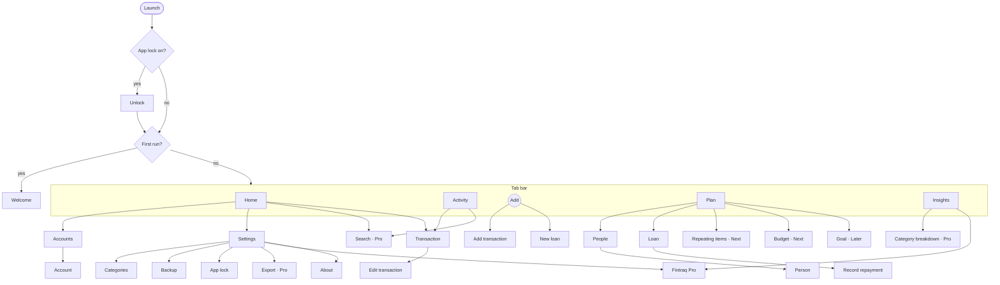
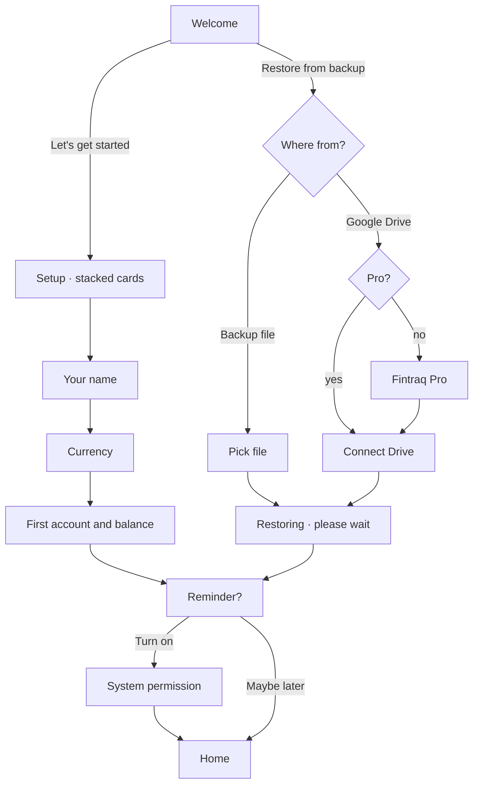
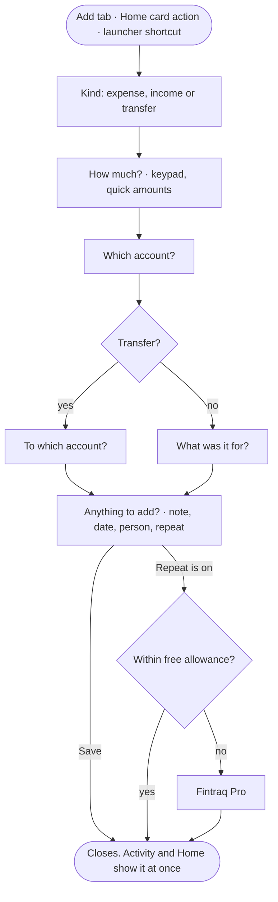
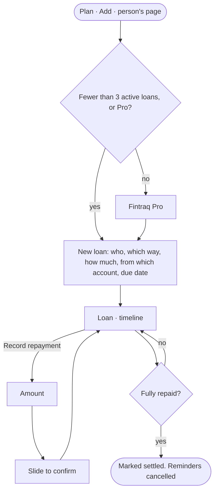
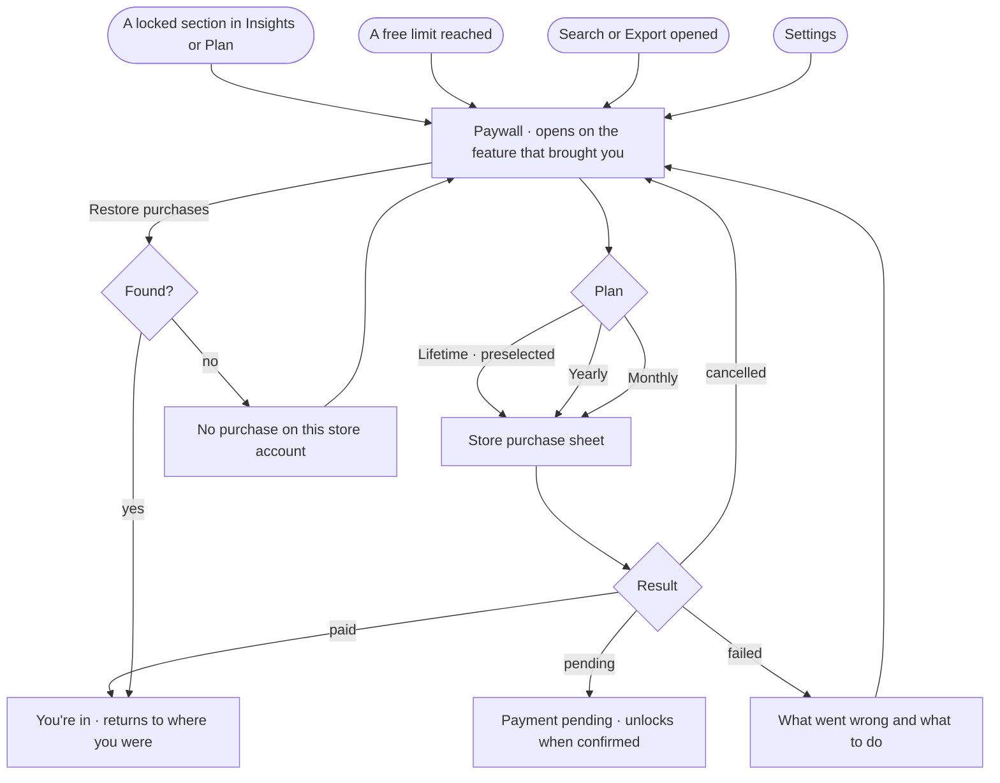
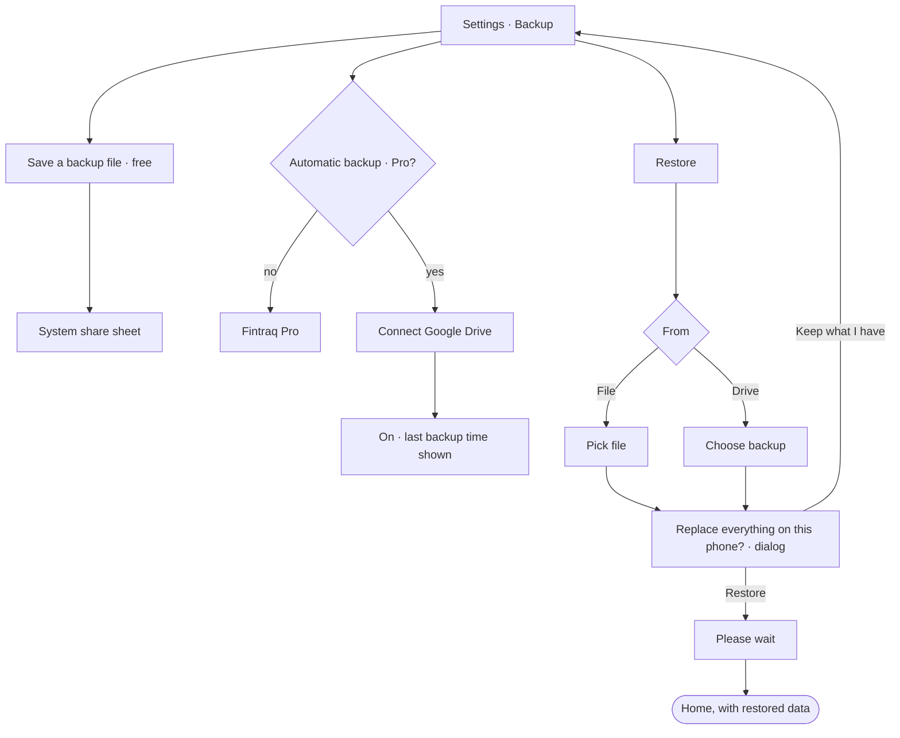
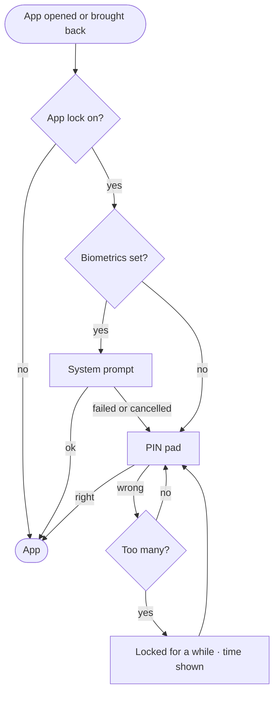

# Screens and flows

Every screen of the rebooted app, where it lives, how people reach it, and the
main journeys through it. Routes are Expo Router paths under `app/`; each
route file only re-exports a screen from `features/<feature>/screens/`.

## Shape of the app

Four places and one action in the tab bar. Everything else is pushed on top
of a tab or presented as a task.

| Tab | Its one job |
| --- | --- |
| **Home** | Where you stand now, and the next thing to do |
| **Activity** | Everything that happened, findable |
| **Add** (centre) | Record something. Opens a task, is not a place |
| **Plan** | What is coming: money owed and owing, repeating items, budgets, goals |
| **Insights** | Why the numbers are what they are |

Settings is not a tab. It opens from the profile icon in Home's header, as in
the reference. Accounts are a section of Home with their own list behind "See
all".

## Screen inventory

Presentation: **tab**, **push** (slides in, back arrow), **task** (rises over
the screen with a serif title and a close button; used for anything you fill
in and finish).

### Start

| Route | Screen | Feature | Shows as | Plan |
| --- | --- | --- | --- | --- |
| `/welcome` | Welcome: start fresh or restore | `onboarding` | full screen | Free |
| `/welcome/setup` | Name, currency, first account, as stacked cards | `onboarding` | task | Free |
| `/welcome/restore` | Pick a backup file or connect Google Drive | `onboarding` | task | File free, Drive Pro |
| `/welcome/reminder` | Offer the daily reminder | `onboarding` | full screen | Free |
| (overlay) | Unlock: PIN pad or biometrics | `lock` | over everything | Free |

### Tabs

| Route | Screen | Feature | Plan |
| --- | --- | --- | --- |
| `/` | Home | `home` | Free |
| `/activity` | Activity: transactions by day, filter chips | `activity` | Free |
| `/plan` | Plan: upcoming, people and loans, budgets, goals | `plan` | Free, with Pro sections |
| `/insights` | Insights: period summary, top categories, findings | `insights` | Free, with Pro sections |

### Money

| Route | Screen | Feature | Shows as | Plan |
| --- | --- | --- | --- | --- |
| `/add` | Add transaction (expense, income, transfer) | `transactions` | task | Free |
| `/transactions/[id]` | Transaction, as a receipt | `transactions` | push | Free |
| `/transactions/[id]/edit` | Edit transaction | `transactions` | task | Free |
| `/accounts` | Accounts and net worth | `accounts` | push | Free |
| `/accounts/[id]` | Account: balance, its activity | `accounts` | push | Free |
| `/accounts/new`, `/accounts/[id]/edit` | Account form | `accounts` | task | Free |
| `/categories` | Categories | `categories` | push | Free |
| `/categories/new`, `/categories/[id]/edit` | Category form | `categories` | task | Free |
| `/search` | Search | `search` | push | Pro |

### Plan

| Route | Screen | Feature | Shows as | Plan |
| --- | --- | --- | --- | --- |
| `/people` | People and balances | `people` | push | Free up to 10 |
| `/people/[id]` | Person: balance, loans, shared activity | `people` | push | Free |
| `/people/new`, `/people/[id]/edit` | Person form | `people` | task | Free |
| `/loans/[id]` | Loan, as a timeline | `loans` | push | Free |
| `/loans/new`, `/loans/[id]/edit` | Loan form | `loans` | task | Free up to 3 active |
| `/loans/[id]/repay` | Record repayment, slide to confirm | `loans` | task | Free |
| `/recurring`, `/recurring/[id]` | Repeating items | `recurring` | push, task | Next. Free up to 2 |
| `/budgets/[id]`, `/budgets/new` | Budget | `budgets` | push, task | Next. Free up to 1 |
| `/goals/[id]`, `/goals/new` | Goal | `goals` | push, task | Later. Free up to 1 |

### Settings and Pro

| Route | Screen | Feature | Shows as | Plan |
| --- | --- | --- | --- | --- |
| `/settings` | Settings: profile, currency, language, appearance, reminder | `settings` | push | Free |
| `/settings/security` | App lock: PIN, biometrics | `lock` | push | Free |
| `/backup` | Backup: file (free), automatic cloud (Pro) | `backup` | push | Mixed |
| `/export` | Spreadsheet export | `export` | push | Pro |
| `/settings/about` | Version, privacy, terms, usage-data switch | `settings` | push | Free |
| `/pro` | Fintraq Pro, in the state that applies: the plans (lifetime first), what is held, or the thank-you after buying | `pro` | task | n/a |

### Developer

No PIN (owner, 2026-10-08). A development build has a "Developer options"
row in Settings. A release build has no way in from the app and opens the
tools only by link (`adb shell am start -d luno://developer me.nafish.luno`);
there it shows diagnostics only, and nothing that changes a user's records
or unlocks Pro.

| Route | Screen | Feature |
| --- | --- | --- |
| `/design-gallery` | Design gallery | `gallery` |
| `/developer`, `/developer/logs` | Developer tools, logs | `developer` |

## Routes that must keep working

The shipped app has put these paths outside the app: in pinned launcher
shortcuts, scheduled notifications and store links. Each stays as a route
file that redirects, for good.

| Old path | Goes to |
| --- | --- |
| `/transactions/create?type=DR\|CR\|TR` (launcher shortcuts) | `/add?kind=expense\|income\|transfer` |
| `/(main)/loans/form` (launcher shortcut) | `/loans/new` |
| `/transactions/edit/[id]` | `/transactions/[id]/edit` |
| `/transactions?accountId=…`, `?categoryId=…` | `/activity` with the same filter |
| `/persons`, `/persons/[id]` | `/people`, `/people/[id]` |
| `/premium?feature=<old id>` | `/pro?feature=<id>` via `resolveProFeature` |
| `/analytics` | `/insights` |
| `/backup`, `/export` | Unchanged: the same paths in the rebuilt app |

## Notifications

Every notification, when it is sent and what a tap opens. The same list, with
its wording, is in Developer under "Read every notification", where each can
be sent to the phone. The voice is in `docs/PRODUCT.md`.

| Notification | Sent when | A tap opens | Channel |
| --- | --- | --- | --- |
| Daily reminder | Once a day at the chosen time (8 PM unless changed), 14 days kept scheduled; none on a day already recorded | `/add?kind=expense` | Reminders (`reminders_chime`) |
| Loan due | The chosen number of days before a loan's due date, at its time | `/loans/[id]` | Reminders |
| Loan payment day | The chosen day of each month, six months kept scheduled | `/loans/[id]` | Reminders |
| Backing up | While a Drive backup runs, with the stage and a progress bar. Goes by itself when the backup works (Android only) | `/backup` | Backup (`backup_status`) |
| Backup did not finish | A backup failed for a reason that may pass | `/backup` | Backup |
| Reconnect Google Drive | A backup failed because the Google session ended | `/backup` | Backup |

The daily reminder carries one of these lines, the most specific that is true
of the day (`platform/notifications/daily-line.ts`):

| Line | When |
| --- | --- |
| Your first entry | Nothing has ever been recorded |
| "Priya owes you $300.00" | A loan with a person is due tomorrow and has no reminder of its own |
| It has been a while | A week without an entry, then once a week while it stays quiet |
| Last day of the month, with the month's count | The month ends today |
| The month starts today | The first of the month |
| Yesterday is missing | Nothing was added yesterday |
| Quiet since (weekday) | Three to six days without an entry |
| The week's count | Sunday, with entries since Monday |
| One line per weekday | Otherwise |

A reminder's text is written when it is scheduled, days ahead, and stays true
because every change to the records schedules them all again.

## Flows

### First run

### Add a transaction

Each answered step stays visible as a tucked card and can be tapped to change
it. Save is disabled, with the reason shown, until there is an amount.

### Lend, borrow and settle

### Reaching Pro and buying

### Backup and restore

### Unlocking

## States every screen designs

Loading (placeholders in the shape of the content), empty (what will be here
and the first step), error (what happened and what to do), and for anything
Pro, the locked state. A control that cannot work yet is disabled with the
reason beside it; it is never left to fail on tap.
